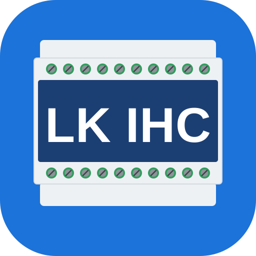
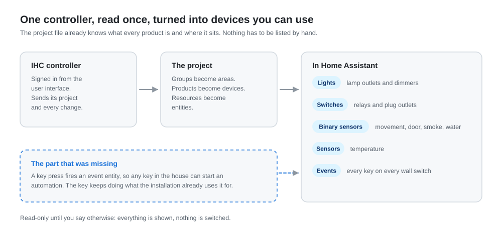
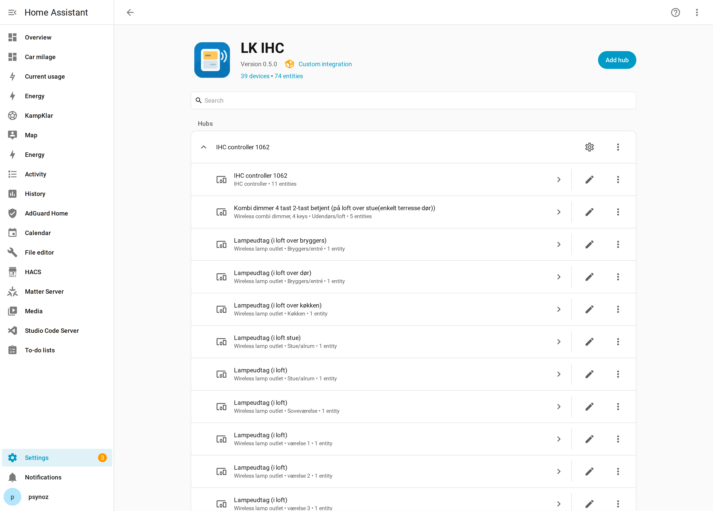
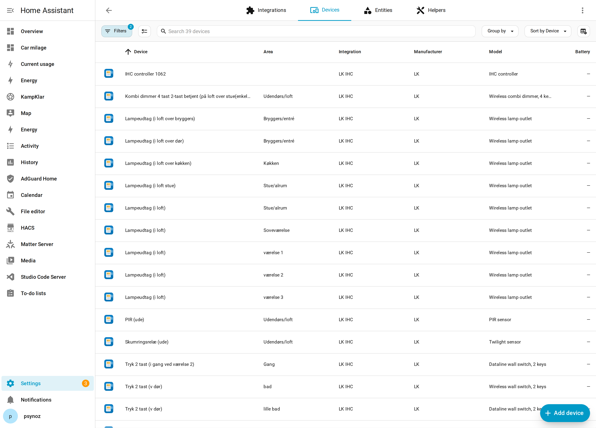
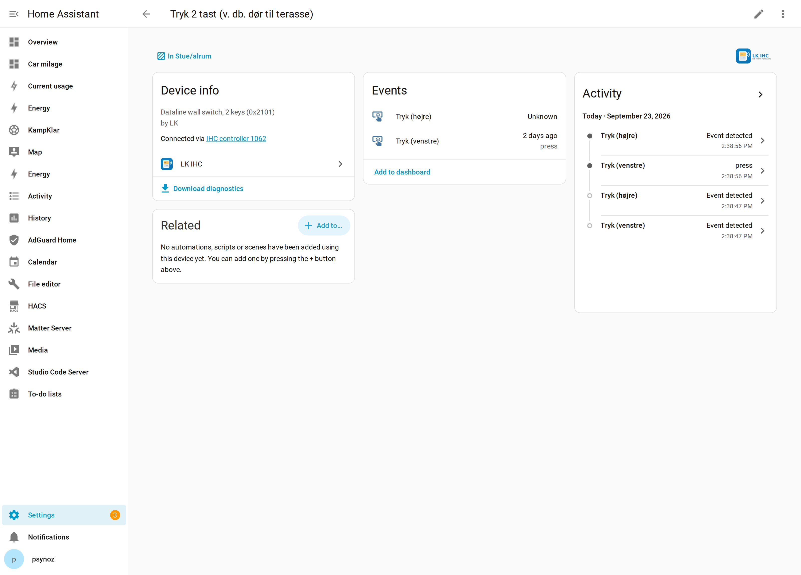
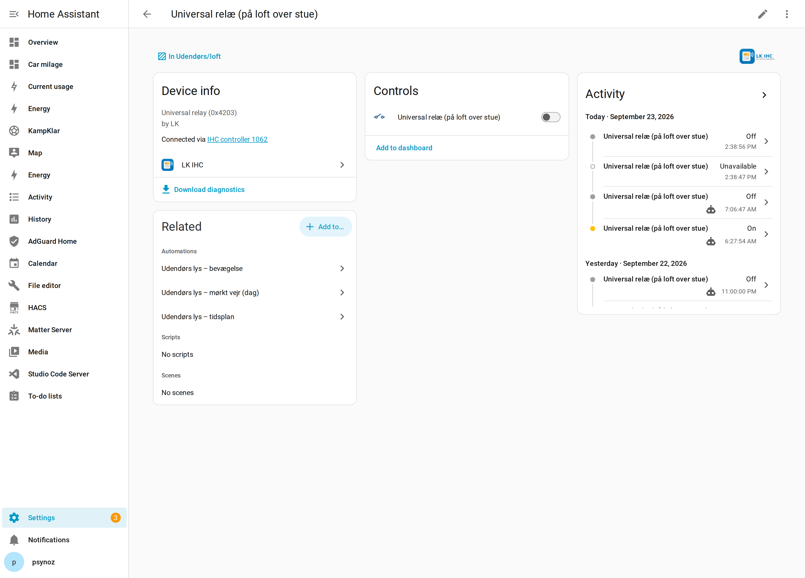
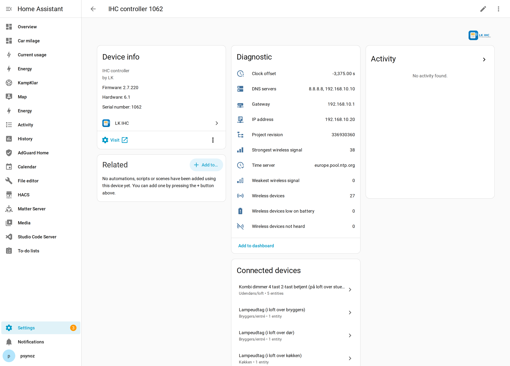
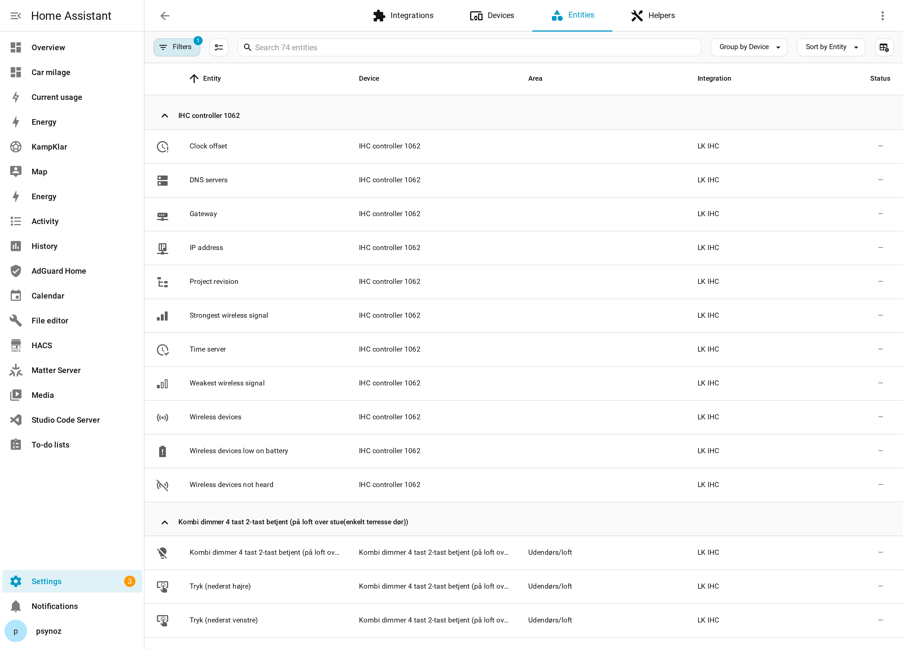

# LK IHC for Home Assistant



A Home Assistant integration for LK IHC controllers that is set up from the user interface, gives
every product its own device, and exposes the thing the built-in integration leaves out: **the keys
on the wall switches**.

[](https://hacs.xyz/)
[](https://opensource.org/licenses/MIT)

<picture>
  <source media="(prefers-color-scheme: dark)" srcset="docs/img/overview-dark.svg">
  
</picture>

## Why

Home Assistant already ships an `ihc` integration. It works, and this one owes it most of what it
knows about IHC products. But it is YAML only, it has no code owner, it creates no devices, and it
maps only outputs and sensors. In a typical house that means the lamp outlets and relays appear, and
the eleven wall switches people actually press do not.

This integration:

- is added from **Settings > Devices & services**, with no YAML at all,
- reads the project from the controller and makes **one device per product**, named and placed the
  way the IHC project has it, so entities land in the right areas,
- creates an **event entity for every key** on every wall switch, so a press can start an automation
  while the key keeps doing whatever the installation already uses it for,
- starts **read-only**, so you can look at a whole installation before Home Assistant is allowed to
  switch anything in it,
- uses a **separate domain** (`lk_ihc`), so it can run next to the built-in `ihc` integration while
  you compare them, and nothing that already works has to be turned off first.

## What this does that the built-in `ihc` does not

Both talk to the same controller over the same SOAP API. The difference is how much of the
installation they let you see.

| | built-in `ihc` | `lk_ihc` |
|---|---|---|
| Set up | `configuration.yaml` only | Settings → Devices & services |
| Devices | none | one per product, 38 in the house below |
| Wall switch keys | not exposed | an `event` entity per key |
| Product names | resource numbers | catalogue names, e.g. "Dataline wall switch, 2 keys" |
| Areas | assigned by hand | suggested from the IHC groups |
| Read-only mode | no | yes, and it is the default |
| What drives an output | not available | `ihc_controlled_by` and `ihc_function_block` |
| Wireless devices | not available | count, low battery, unheard, signal strength |
| Controller clock | not available | offset against Home Assistant, and the time server |
| Controller address | not available | IP, gateway and name servers |
| Project revision | not available | shown, so a redeployed project is visible |
| Diagnostics download | no | yes |
| Code owner | none | yes |

### The integration page

Set up from the user interface, with a version and a device count. The built-in one has no page of
its own at all.



### One device per product

Each product in the IHC project becomes a device, named and placed the way the project has it. The
built-in integration creates none, so everything lands in a flat list of entities with no hardware
behind them.



### The wall switches

Every key on every switch is an `event` entity. These are the most useful trigger an IHC house has,
and the built-in integration does not expose them at all, so the switches are invisible to Home
Assistant even though people press them all day.



### What drives an output

The project file holds the controller's own logic - a wall switch toggling a relay, a PIR lighting a
lamp - and the links that wire it to products. Those links are followed at setup, so a relay that
changes without Home Assistant asking can say what moved it:

```yaml
ihc_controlled_by: ["Tryk 2 tast (v. db. dør til terasse)"]
ihc_function_block: ["Kip blok med tænd, sluk og timer funktion"]
```



### The controller itself

What we do not control, we can still read. Eleven diagnostic sensors on the controller device: the
wireless devices it hears and how they are doing, its clock measured against Home Assistant's, its
address, and the project revision. All read-only - changing any of it belongs in IHC Administrator.

The clock is the one worth watching. A controller runs its own time-based logic, so a clock that has
drifted quietly moves when the house does things. The one below is 3,375 seconds behind, with NTP
enabled and evidently not working.



### Every entity



## Not breaking things

This talks to the system that runs the lights in a real house, so:

- **Read-only by default.** A new controller is set up read-only. Everything is shown, and any
  attempt to switch something says why it did not. Turn it off in the options when you are ready.
- **Nothing is written at startup.** Setting up reads the project and subscribes to values. A
  command is only ever sent because someone or some automation asked for one.
- **Commands are bounded.** A command only goes to a resource that came from the controller's own
  project, and every request to the controller has an HTTP timeout, which the sdk does not set on
  its own. A controller that stops answering mid request cannot hold a Home Assistant worker thread
  for ever.
- **Keys are read, never driven.** Wall switch keys are inputs. The integration subscribes to them
  and never writes to them, so the installation's own wiring is untouched.
- **It runs beside the old one.** Different domain, different entity ids, its own config entry. If
  you do not like it, delete the entry and nothing else changes.

## Install

### HACS

1. HACS > three-dot menu > **Custom repositories**.
2. Add `https://github.com/FrederikLeed/ha-lk-ihc` with the category **Integration**.
3. Install **LK IHC** and restart Home Assistant.

### Manual

Copy `custom_components/lk_ihc/` into `config/custom_components/` and restart.

Home Assistant 2026.3 or newer.

## Set up

**Settings** > **Devices & services** > **Add integration** > **LK IHC**, then give it:

| Field | Value |
|---|---|
| Address | `http://192.168.1.3`, the controller's address on your network. `https://` works if the controller is set up for it. |
| Username | An IHC user. Reading is enough to start; controlling needs a user that may operate the installation. |
| Password | That user's password. |

The integration signs in, reads the project, and creates the devices and entities. The entry is
read-only until you say otherwise: **Configure** on the entry, then turn **Read-only** off.

## What you get

| Platform | From | Notes |
|---|---|---|
| Light | Lamp outlets and dimmers | A dimmer gets brightness, an outlet is on or off. |
| Switch | Relays and plug outlets | |
| Binary sensor | PIR, magnet contacts, smoke, leak, twilight | With the right device class, so Home Assistant shows them properly. |
| Sensor | Temperature and other measured values | |
| Event | Every key on every wall switch | Fires `press`. This is the part the built-in integration does not have. |

Products the catalogue does not know still appear: their outputs become switches, and their inputs
become binary sensors that are created disabled, so nothing is hidden and nothing is in the way.

### Using a wall switch key in an automation

```yaml
automation:
  - alias: "Double press by the terrace door turns everything off outside"
    triggers:
      - trigger: state
        entity_id: event.living_room_wall_switch_2_keys_by_the_terrace_door_key_left
    conditions:
      - condition: template
        value_template: "{{ trigger.to_state.attributes.event_type == 'press' }}"
    actions:
      - action: light.turn_off
        target:
          area_id: outside
```

An event entity's state is the time of the last press, so a repeated press is a new state and a
trigger fires every time. The key keeps switching whatever IHC has it wired to.

## Options

| Option | What it does |
|---|---|
| Read-only | While on, no command is ever sent to the installation. |
| Wall switch keys as events | Create the event entities. Turn it off for a smaller entity list. |

Changing an option reloads the entry, which takes a second or two and needs no restart.

## Moving over from the built-in `ihc` integration

You can run both at once, which is the point of the separate domain. To move over:

1. Install this one, set it up, and leave the YAML integration alone.
2. Compare: the lights and relays should appear in both, with the same states.
3. Turn read-only off here and test one light.
4. Point your automations, scripts and dashboards at the new entity ids. They differ, because the
   old ones are built from the IHC resource number (`light.stue_alrum_303966`) and the new ones from
   the product and its position (`light.stue_alrum_lampeudtag_i_loft`).
5. Remove the `ihc:` block from `configuration.yaml` and restart.

Nothing forces step 5. Two integrations talking to one controller is allowed; each holds its own
session.

## How the devices read

Each device is named and described from the project, so the device list says what the thing is
rather than what number it has:

| | |
|---|---|
| Name | The product and where it sits: `Universal relay (on the loft above the hall)` |
| Model | The product in words: `Dataline wall switch, 2 keys` |
| Model id | The identifier the project file uses: `0x2101` |
| Manufacturer | LK |
| Area | The IHC group the product is in |
| Connected through | The controller, so the whole installation hangs off one device |

Entities take their icon from what they are: a key is `mdi:gesture-tap-button`, a relay is
`mdi:electric-switch`, a plug outlet is `mdi:power-socket`. Lights, binary sensors and the
temperature sensors are left alone on purpose, because Home Assistant already picks those from the
device class and changes them with the state.

## Diagnostics

**Download diagnostics** on the entry gives the controller's firmware, how many products and
resources were found, and which product identifiers are in the installation, plus how many of them
the catalogue does not recognise. It reports identifiers rather than model names, because a product
the catalogue does not know takes its name from the project file, which is text the owner wrote about
their own house. There is no address, no login, no room name, no product position and no entity id in
it, so it can be attached to an issue as it is.

## Limits

- Tested against an LK IHC controller with firmware 2.7.220 and a project of 38 products. Other
  firmware should work, because the interface has not changed in years, but it has not been proven
  here.
- A key press fires on the leading edge. Hold, double press and release are not distinguished yet.
- Scenes, timers and other IHC function block resources are not exposed.
- The controller has no notion of "unavailable" for a single product, so an entity keeps its last
  known value until the controller reports a new one.
- The project is read at setup. If you change the installation in the IHC software, reload the entry
  to pick it up.

## The graphics

The icon, the wordmark and the diagram above are generated from
[`tools/build_brand.py`](tools/build_brand.py), so a change to any of them is a diff rather than a
binary someone has to open in an editor:

```bash
.venv/bin/pip install cairosvg
.venv/bin/python tools/build_brand.py           # writes brand/ and docs/img/
.venv/bin/python tools/build_brand.py --check   # fails when they are out of date
```

Home Assistant serves `custom_components/lk_ihc/brand/icon.png` and its larger sizes directly, so
the integration shows its own mark without waiting for the brands repository.

## Design history

How this integration reached its current shape, and the two investigations (a firmware
teardown, an API evaluation) that shaped what it does and does not do:
[docs/how-we-got-here.md](docs/how-we-got-here.md).

## Development

```bash
python3.14 -m venv .venv
.venv/bin/pip install -r requirements_test.txt ruff==0.16.7 ihcsdk==2.8.12 defusedxml==0.7.1
.venv/bin/python -m pytest --cov=custom_components/lk_ihc --cov-report=term-missing
.venv/bin/ruff check . && .venv/bin/ruff format --check .
```

The tests never touch a network: the sdk controller is replaced by a stand-in, and the project comes
from an invented file in `tests/fixtures/`.

## Credit and license

The product identifiers and what they mean come from Home Assistant's own `ihc` integration, which
is the accumulated work of its contributors. Talking to the controller is done with
[ihcsdk](https://pypi.org/project/ihcsdk/).

Not affiliated with LK, Schneider Electric or Lauritz Knudsen. MIT licensed.
